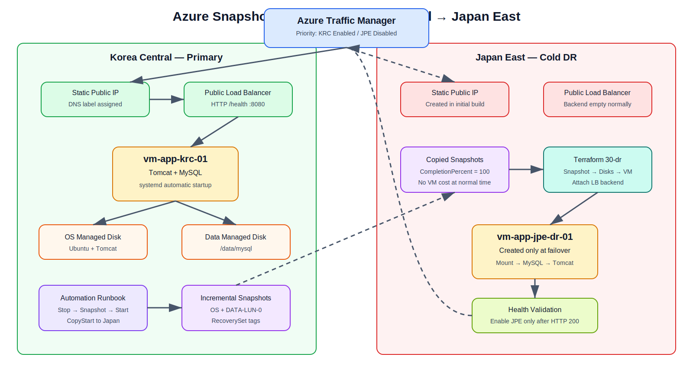
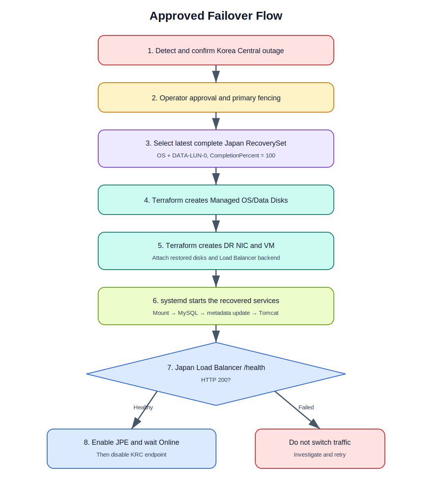

# Azure Snapshot Cold DR: Korea Central → Japan East

Terraform, Azure Automation Runbook, systemd, Ansible, Azure Load Balancer와 Azure Traffic Manager를 이용한 **Snapshot 기반 Cold DR 실습 프로젝트**입니다.

주센터인 **Korea Central**에는 VM, Tomcat, MySQL 및 전체 네트워크를 구성합니다. DR센터인 **Japan East**에는 평상시 VNet, Subnet, NSG, Static Public IP, Load Balancer와 Traffic Manager Endpoint만 유지하고 **VM은 생성하지 않습니다**. 장애가 승인되면 도쿄에 복사된 최신 Incremental Snapshot으로 VM을 생성하고, 서비스 검증 후 Traffic Manager를 도쿄로 전환합니다.



## 1. 설계 목표

| 항목 | 설계 |
|---|---|
| DR 방식 | Managed Disk Incremental Snapshot 기반 Cold DR |
| Primary Region | Korea Central |
| DR Region | Japan East |
| 운영 서버 | Ubuntu VM 1대, Tomcat 9, MySQL |
| OS 저장소 | Managed OS Disk |
| DB 저장소 | 별도 Managed Data Disk, `/data/mysql` |
| Snapshot 자동화 | Azure Automation Runbook |
| DR VM 생성 | Terraform, 장애 시에만 실행 |
| 서비스 기동 | systemd 기본, VM Extension 후처리 |
| 서비스 검증 | Ansible 및 Load Balancer `/health` |
| 트래픽 전환 | Azure Traffic Manager Priority Routing |
| 평상시 Endpoint | Korea Enabled / Priority 1 |
| DR Endpoint | Japan Disabled / Priority 2 |

이 프로젝트는 ASR보다 비용을 줄이는 대신 RPO와 RTO가 더 큰 **Cold DR** 예제입니다. 짧은 RPO가 필요한 중요 DB는 MySQL Native Replication을 별도로 사용해야 합니다.

## 2. 초기 구축과 장애 시 구축 범위

### 초기 구축

| 리소스 | Korea Central | Japan East |
|---|---:|---:|
| Resource Group | 생성 | 생성 |
| VNet/Subnet/NSG | 생성 | 생성 |
| Static Service Public IP | 생성 | 생성 |
| Standard Public Load Balancer | 생성 | 생성 |
| LB Backend Pool | 운영 VM 연결 | 비어 있음 |
| LB Probe `/health` | 생성 | 생성 |
| Traffic Manager Endpoint | Enabled, Priority 1 | Disabled, Priority 2 |
| VM | 생성 | 생성하지 않음 |
| OS/Data Managed Disk | 생성 | 생성하지 않음 |
| Tomcat/MySQL | 설치·기동 | 없음 |
| Incremental Snapshot | 서울에서 생성 | 도쿄에 복사본 보관 |

### 장애 발생 후

| 순서 | 작업 | 도구 |
|---:|---|---|
| 1 | 장애 확인 및 DR 전환 승인 | 운영자/Azure Monitor |
| 2 | 서울 Primary Fencing 확인 | 운영 절차 |
| 3 | 최신 완료 RecoverySet 선택 | Python External Data Source |
| 4 | Snapshot에서 OS/Data Managed Disk 생성 | Terraform |
| 5 | 도쿄 NIC와 VM 생성 | Terraform |
| 6 | 도쿄 LB Backend Pool에 NIC 연결 | Terraform |
| 7 | Data Disk Mount, MySQL, Tomcat 기동 | systemd/VM Extension |
| 8 | MySQL Region/IP 갱신 및 `/health` 검증 | systemd/Ansible |
| 9 | JPE Endpoint 활성화 및 `Online` 확인 | Traffic Manager Script |
| 10 | KRC Endpoint 비활성화 | Traffic Manager Script |



## 3. Traffic Manager 동작

Traffic Manager는 프록시나 패킷 전달 장비가 아니라 **DNS 기반 라우팅 서비스**입니다.

```text
app.example.com
      CNAME
      ↓
snapdr-xxxxxxxx.trafficmanager.net
      ↓ Priority routing
Korea LB FQDN 또는 Japan LB FQDN
```

- 정상 운영: Korea Endpoint만 활성화
- DR VM 생성 중: Japan Endpoint는 비활성 상태 유지
- Japan `/health`가 HTTP 200: Japan Endpoint 활성화
- Traffic Manager Monitor가 `Online`: Korea Endpoint 비활성화
- 새 DNS 조회와 새 연결부터 Japan East로 전환

Public IP를 Traffic Manager Azure Endpoint로 사용할 때 Public IP에는 DNS Label이 필요하므로 Terraform에서 양쪽 Service Public IP에 `domain_name_label`을 설정합니다.

사용자 도메인은 별도 DNS 서비스에서 다음 CNAME을 추가합니다.

```text
app.example.com CNAME <terraform output traffic_manager_fqdn>
```

## 4. Repository 구조

```text
.
├── README.md
├── Makefile
├── docs
│   ├── DEPLOYMENT.md
│   ├── OPERATIONS.md
│   ├── diagrams
│   │   ├── architecture-overview.dot
│   │   └── failover-flow.dot
│   └── images
│       ├── architecture-overview.svg
│       └── failover-flow.svg
├── terraform
│   ├── 00-network       # 양쪽 네트워크, LB, Traffic Manager
│   ├── 10-primary       # 서울 VM, OS/Data Disk, LB 연결
│   ├── 20-automation    # Automation Account와 Snapshot Runbook
│   └── 30-dr            # 장애 시 도쿄 Disk/VM/LB 연결
├── runbooks
│   └── Copy-ManagedDiskSnapshots.ps1
├── scripts
│   ├── find_latest_snapshot.py
│   ├── dr-failover.sh
│   ├── dr-destroy.sh
│   ├── traffic-switch.sh
│   └── failback-primary.sh
└── ansible
    └── start-and-validate.yml
```

## 5. 사전 준비

- Azure CLI
- Terraform 1.6 이상
- Python 3
- SSH Key
- 선택: Ansible Core
- Snapshot Runbook용 Az PowerShell Module
  - `Az.Accounts`
  - `Az.Compute`

Azure 로그인:

```bash
az login
az account set --subscription "<SUBSCRIPTION_ID>"
```

SSH Key 생성:

```bash
ssh-keygen -t ed25519 -f ~/.ssh/azure_snapshot_dr -C azure-snapshot-dr
```

## 6. 1차 구축

### 6.1 Network, Load Balancer, Traffic Manager

```bash
cd terraform/00-network
cp terraform.tfvars.example terraform.tfvars
```

`terraform.tfvars`:

```hcl
subscription_id   = "00000000-0000-0000-0000-000000000000"
admin_source_cidr = "203.0.113.10/32"
app_source_cidr   = "0.0.0.0/0"
```

배포:

```bash
terraform init
terraform fmt -check
terraform validate
terraform plan
terraform apply
```

확인:

```bash
terraform output traffic_manager_fqdn
terraform output primary_service_fqdn
terraform output dr_service_fqdn
```

### 6.2 Korea Central VM

```bash
cd ../10-primary
cp terraform.tfvars.example terraform.tfvars
```

```hcl
subscription_id     = "00000000-0000-0000-0000-000000000000"
ssh_public_key_path = "~/.ssh/azure_snapshot_dr.pub"
```

```bash
terraform init
terraform plan
terraform apply
```

VM 내부 구성:

- Tomcat 9
- MySQL
- OS Managed Disk
- LUN 0 Data Managed Disk
- `/data/mysql` → `/var/lib/mysql` Bind Mount
- `dr_demo.instance_info` 테이블
- systemd 기반 자동기동 및 Metadata 갱신
- `/health`: MySQL과 Data Disk가 정상일 때만 HTTP 200

MySQL 확인:

```bash
ssh -i ~/.ssh/azure_snapshot_dr \
  azureuser@$(terraform output -raw management_public_ip)

sudo mysql -e "SELECT * FROM dr_demo.instance_info\G"
```

### 6.3 Snapshot Automation

```bash
cd ../20-automation
cp terraform.tfvars.example terraform.tfvars
terraform init
terraform apply
```

최초 테스트 전에는 다음 값을 유지합니다.

```hcl
enable_schedule = false
```

Portal에서 Runbook을 수동 실행하여 OS와 Data Snapshot이 Japan East에 정상 복사되는 것을 확인한 뒤 Schedule을 활성화합니다.

## 7. Runbook 작업

`Copy-ManagedDiskSnapshots.ps1`의 실행 순서는 다음과 같습니다.

1. System-assigned Managed Identity로 Azure 로그인
2. 서울 VM의 OS/Data Managed Disk 조회
3. VM Run Command로 Tomcat과 MySQL 정지
4. 동일 RecoverySet Tag로 Incremental Snapshot 생성
5. 서울 서비스를 즉시 재기동
6. `CopyStart`로 Japan East에 Snapshot 복사
7. Target Snapshot의 `CompletionPercent=100` 확인
8. Retention 기간이 지난 Snapshot 삭제

주요 Tag:

| Tag | 예시 |
|---|---|
| `ManagedBy` | `SnapshotDRDemo` |
| `SourceVM` | `vm-app-krc-01` |
| `RecoverySet` | `20260712T030000Z` |
| `DiskRole` | `OS`, `DATA-LUN-0` |
| `CopyStage` | `Source`, `Target` |

## 8. 장애 시 도쿄 VM 생성 및 전환

### 8.1 DR Terraform 준비

```bash
cd terraform/30-dr
cp terraform.tfvars.example terraform.tfvars
```

```hcl
subscription_id = "00000000-0000-0000-0000-000000000000"
```

### 8.2 승인형 Failover 실행

```bash
cd ../..
./scripts/dr-failover.sh ~/.ssh/azure_snapshot_dr azureuser
```

스크립트 동작:

1. `terraform/30-dr` 실행
2. 최신 완료 OS/Data Snapshot Pair 선택
3. Japan East Managed Disk와 VM 생성
4. DR LB Backend Pool 연결
5. systemd/Ansible 서비스 기동·검증
6. DR Load Balancer `/health` 확인
7. Japan Traffic Manager Endpoint 활성화
8. Endpoint Monitor가 `Online`인 경우에만 Korea Endpoint 비활성화

Traffic Manager 상태 확인:

```bash
./scripts/traffic-switch.sh status
```

수동 DR 전환:

```bash
./scripts/traffic-switch.sh dr
```

## 9. Failback

서울 서비스와 데이터가 복구되고 `/health`가 정상인 경우:

```bash
export PRIMARY_HEALTH_URL="http://<KRC_LB_FQDN>:8080/health"
./scripts/failback-primary.sh
```

스크립트는 Korea Endpoint를 먼저 활성화하고 `Online` 상태를 확인한 뒤 Japan Endpoint를 비활성화합니다.

> Snapshot Cold DR에서 Data를 다시 서울로 되돌리는 절차는 별도 설계가 필요합니다. 단순 Traffic Manager 역전환만으로 DB 데이터가 자동 동기화되지는 않습니다.

## 10. RPO와 RTO 예시

| 항목 | 1시간 Snapshot | 4시간 Snapshot |
|---|---:|---:|
| Snapshot 간격 | 60분 | 240분 |
| 리전 복사 지연 예시 | 10~40분 | 10~40분 |
| 설계 RPO 예시 | 약 1시간 40분 | 약 4시간 40분 |
| Disk/VM 생성 | 10~40분 | 10~40분 |
| 서비스 기동·검증 | 5~20분 | 5~20분 |
| DNS 전환 | TTL 및 Resolver Cache 영향 | TTL 및 Resolver Cache 영향 |
| 설계 RTO 예시 | 약 30~90분 | 약 30~90분 |

위 시간은 보장값이 아니라 테스트 기준의 설계 예시입니다. 실제 값은 Disk 크기, 변경량, Azure API 처리시간, MySQL 복구시간과 DNS Cache에 따라 달라집니다.

## 11. 운영 주의사항

- 이 구성은 Public Load Balancer 기반입니다. Private 전용 서비스에는 Traffic Manager를 직접 사용할 수 없습니다.
- Traffic Manager는 기존 TCP Session을 전환하지 않습니다.
- Japan Endpoint는 VM 생성과 `/health` 검증 전까지 Disabled 상태로 유지합니다.
- 동일 Disk 계열 Snapshot은 생성 순서대로 복사합니다.
- Target Snapshot 복사가 완료되기 전에 Source Snapshot을 삭제하지 않습니다.
- Snapshot 전 MySQL을 정지하므로 짧은 서비스 중단이 발생합니다.
- 중요 DB는 MySQL Native Replication 또는 별도 Backup을 병행합니다.
- Split Brain 방지를 위해 DR 전환 전 Primary Fencing을 확인합니다.
- Terraform State는 Local이 아니라 Azure Storage Backend 사용을 권장합니다.
- 예제의 Automation Contributor 권한은 운영 시 Custom Role로 축소합니다.
- 분기별 Test DR을 수행하여 실제 RTO를 측정합니다.

## 12. 공식 참고자료

- [Copy an incremental snapshot to a new region](https://learn.microsoft.com/azure/virtual-machines/disks-copy-incremental-snapshot-across-regions)
- [Traffic Manager routing methods](https://learn.microsoft.com/azure/traffic-manager/traffic-manager-routing-methods)
- [Traffic Manager endpoint types](https://learn.microsoft.com/azure/traffic-manager/traffic-manager-endpoint-types)
- [Traffic Manager endpoint monitoring](https://learn.microsoft.com/azure/traffic-manager/traffic-manager-monitoring)
- [Azure Automation managed identity](https://learn.microsoft.com/azure/automation/enable-managed-identity-for-automation)

## 13. 면책

이 저장소는 학습 및 PoC 목적의 예제입니다. 실제 운영 반영 전 보안, 비용, Backup, MySQL 복구, DNS, 인증서, 모니터링, Terraform State와 장애 승인 절차를 조직 표준에 맞게 검토하십시오.
